# TL;DR:

- Initial render improved by 7% - ok
- Search improved by 33% - nice
- Select Year slowed down by 75% - not ok
- Sort improved by 50% - NICE

---

## Initial render

### Before

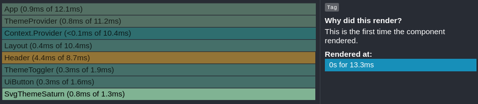
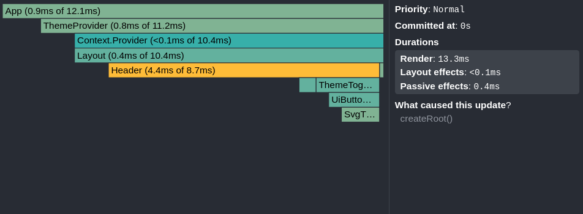

### After

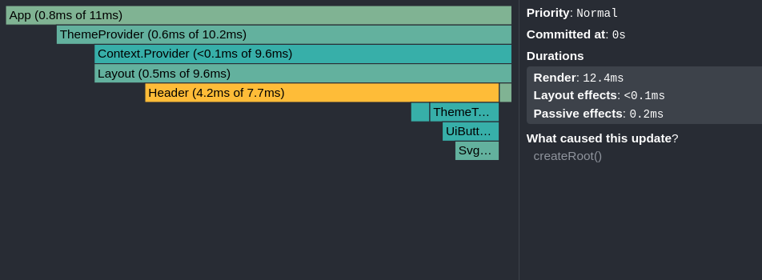
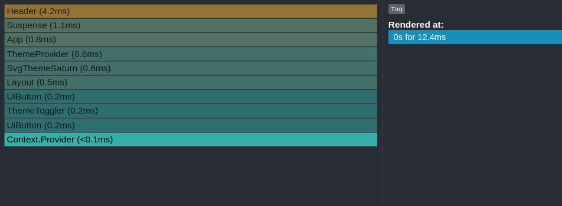

## Searching: 'unite'

### Before

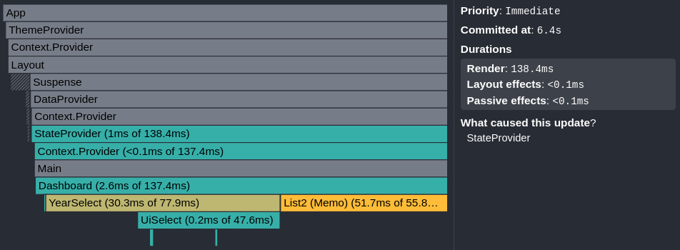
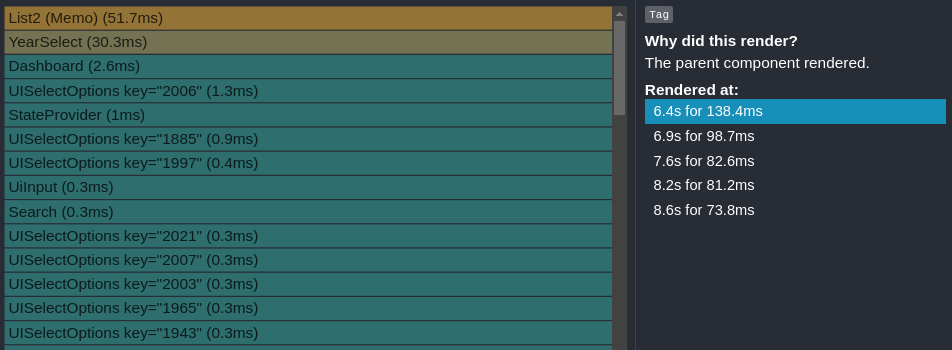

### After

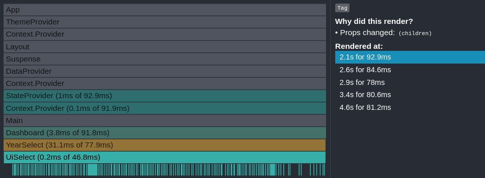
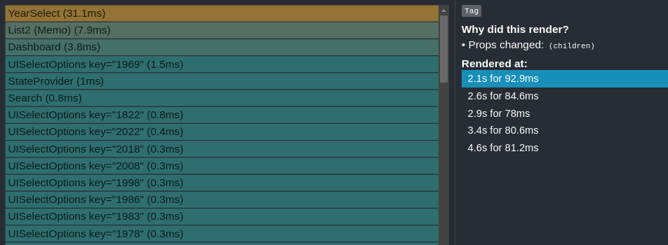

## Selecting Year

### Before

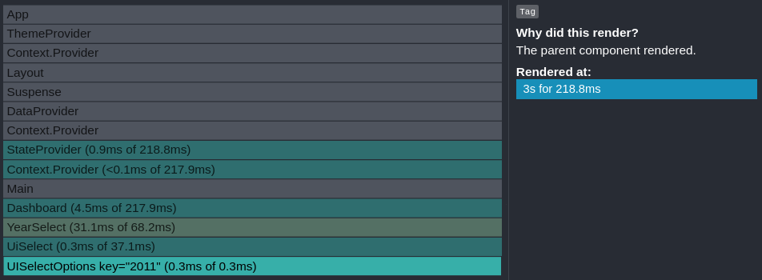
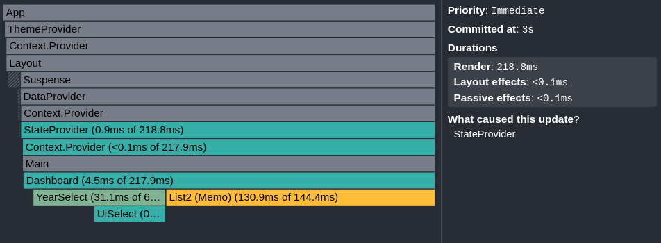

### After

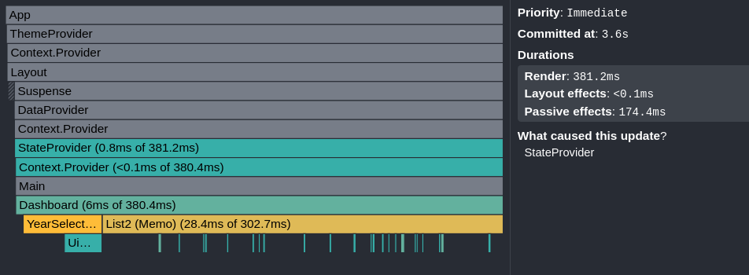
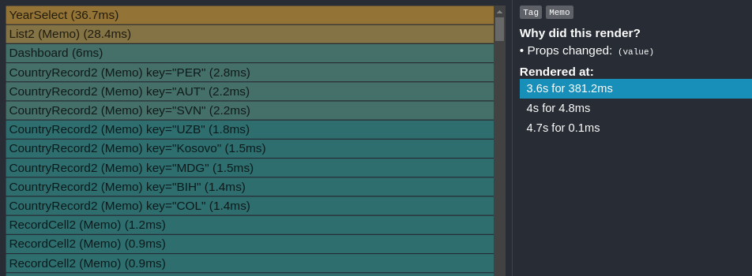

## Sorting

### Before

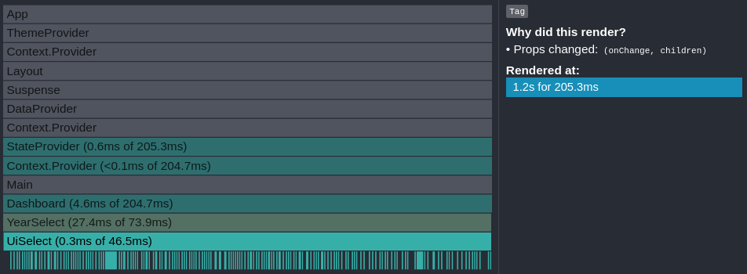
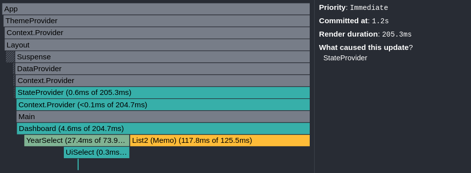

### After

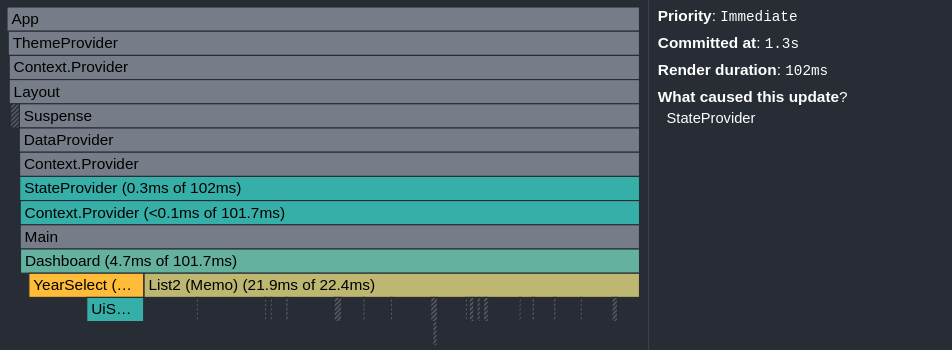
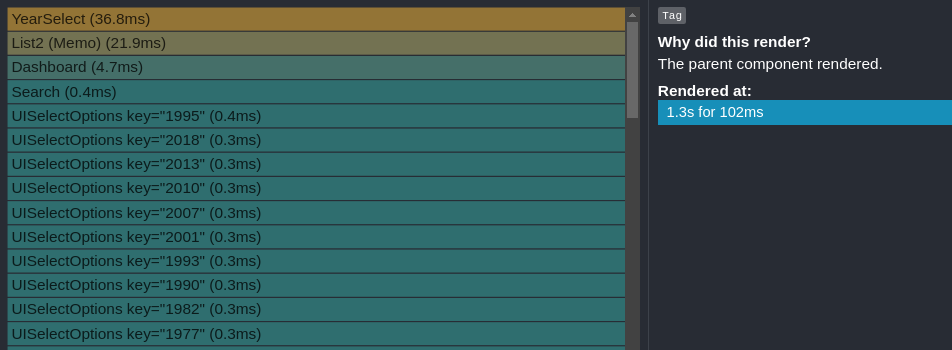

---

### Render Duration (ms)

|            | Initial Render | Search  | Select Year | Sorting |
| ---------- | -------------- | ------- | ----------- | ------- |
| **Before** | 13.3ms         | 138.4ms | 218ms       | 205.3ms |
| **After**  | 12.4ms         | 92.9ms  | 381ms       | 102.0ms |

**Observations:**

- Initial render slightly improved
- Search became faster
- Select Year became slower =(
- Sorting improved significantly :D

### Commit Duration (ms)

|            | Initial Render | Search | Select Year | Sorting |
| ---------- | -------------- | ------ | ----------- | ------- |
| **Before** | 0ms            | 6.4ms  | 3.0ms       | 1.2ms   |
| **After**  | 0ms            | 2.1ms  | 3.6ms       | 1.3ms   |

**Observations:**

- Commit duration unchanged for Initial render (duh)
- Search commit duration improved
- Select Year slightly worse
- Sorting almost unchanged

---

# Summary

Memoization techniques **reduced render times and commits SEARCH and SORTING**, which are considered the main features of the app.

Initial render time also saw a tiny bump.

However, the **selecting year** performance dropped significantly and needs to be addressed.

Overall, the refactoring delivered a **net positive effect on percived performance**.
